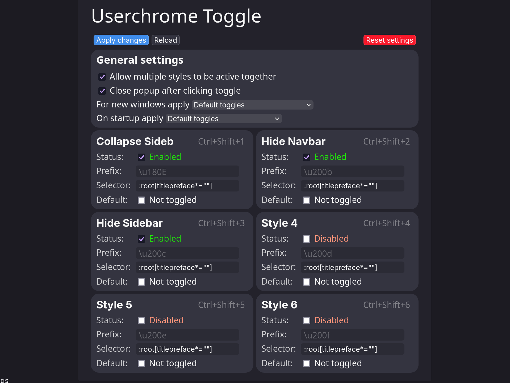

# PotatoFox


## Compatibility

Tested on Linux and MacOS, hasn't been tested on Windows recently. 

## Features

- collapsing vertical tabs using Sidebery 
- pop-up arc-like urlbar
- option to hide the navbar  
- ability to remove borders around webpage for an ultra minimal experience
- general visual enhancements  
- custom SVG icons for some extensions
- support for vertical tabs on the left or right

## Screenshots


## Install Instructions

Extension:

* [Sidebery](https://addons.mozilla.org/en-US/firefox/addon/sidebery)
* [Userchrome Toggle Extended](https://addons.mozilla.org/en-US/firefox/addon/userchrome-toggle-extended)
* [Firefox Color](https://addons.mozilla.org/en-US/firefox/addon/firefox-color) (optional)

Open the [releases tab](https://codeberg.org/awwpotato/PotatoFox/releases) and download the correct release for your version of Firefox (Urlbar > about:support > Application Basics > Version). Then copy the chrome directory and user.js file into your Firefox profiles directory (about:support > Application Basics > Profile Directory), then restart Firefox.

<details><summary>Advanced (cli) install (macOS/Linux)</summary>

#### Using git
```bash
git clone https://codeberg.org/awwpotato/potatofox.git
cd potatofox
ln -sr user.js chrome ~/.mozilla/firefox/<profile> # Linux
cp -r user.js chrome ~/Library/Application Support/Firefox/Profiles/<profile> # macOS 
```
#### Using [Nyoom](https://github.com/ryanccn/nyoom)
```bash
nyoom profile <profile-dir>
nyoom add codeberg:awwpotato/potatofox
nyoom switch potatofox
```
> [!NOTE]
> Make sure to install the required extensions.

</details>

## Post Install

- Import Sidebery config (Sidebery Settings > Help > Import addon data)
- Import Firefox Color [Theme](https://color.firefox.com/?theme=XQAAAAJLBAAAAAAAAABBqYhm849SCicxcUcPX38oKRicm6da8pG5gi-DrbS7fiEFLUzDsWXWyUHMSkHZ2PpRK_LvZGTF44fp7VnVXujpkKMjvOWQSIhdK22u1ZG2EgdMyNMx_0oKJ3H6SApxy3IyQ4DsJp5wXsJAe_-1mtfWgRDmsdoSCoijQWJMgbopoYEZC-RlLTcZGRDec_YbCL7rnqK6TAlv9HrKP2vKGFddbs2RHmpKmp4nTmraRv5vn93Xej36dJ4PJLs8lR2xW5gEjnC2yNLDH0ltCV_dOCQU1k6C8gqp4WDfYkereqQMlzloT6ayCj_r86A_oAdsjNzxh2Qs7OpWSWEmt1D06L1Xq2dYeaBXH9ZTiFsKY5cURy2M6x_Epyax9nYbJGEIEnsjyqDTYe4ssM-VVYSrKhHTFwcmZpvjIDgAiafTRbAL5lonNLHF9S7KkU6O9y9KVvR2ZCFf2v6tYSpyu0pLOZEFN9_9czNq4YY1eac1Ciaw-_h5RgHX3pDHDFrzk6gSI1tW-iLlTDyDu8f1rVKzRJNxgLE0yzDpy6-qm0ihyKgRX6UlVuRTm_5nV9WkMF0UeIzsABE_aBxh8cr_0f-fxA) (Optional)
- about:addons (url) > Userchrome Toggle Extended preferences > General settings > allow multiple styles to be active together, apply changes 

> [!WARNING]
> Websites with a white background will have an incorrect background, this can be fixed by using [Dark Reader](https://addons.mozilla.org/firefox/addon/darkreader/)

> [!NOTE]
> On Linux there may be extra padding before/after the window controls, this can be fixed by changing line 36-38 in `chrome/vars.css`

> [!NOTE]
> If fingerprinting is a concern for you, I recommend enabling `uc.tweak.no-custom-icons` and removing `svg.context-properties.content.enabled` from `user.js`

### Recommended Userchrome Toggle Extended settings


### about:config tweaks 
| Setting                                | Description                                                                                                                          |
|----------------------------------------|--------------------------------------------------------------------------------------------------------------------------------------|
| uc.tweak.borderless                    | removes margins around the webpage                                                                                                   |
| uc.tweak.no-custom-icons               | Don't apply custom monochrome icons for some extensions                                                                              |
| uc.tweak.no-window-controls            | Removes window controls                                                                                                              |
| uc.tweak.no-panel-hint                 | hide the small bars showing location of hidden panels                                                                                |
| uc.tweak.no-animations                 | disable animations added by this theme                                                                                               |
| uc.tweak.regular-search                | return urlbar to original state                                                                                                      |
| uc.tweak.findbar.bottom                | moves findbar to bottom of webpage (causes it to not be visible when devtools are active on bottom)                                  |
| sidebar.position_start                 | Controls if the sidebar is on the left or right                                                                                      |
| uc.tweak.sidebar.short                 | makes sidebar shorter when hovering (140px)                                                                                          |
| uc.tweak.sidebar.wide                  | makes sidebar wider when hovering (200px)                                                                                            |
| uc.tweak.sidebar.header                | show sidebar header                                                                                                                  |
| uc.tweak.sidebery.big-pinned           | Pinned tabs look like buttons, like Arc's pinned tabs (make sure to set Sidebery settings > tabs > pinned tabs > Show titles is off) |
| uc.tweak.sidebery.top-navbar           | move Sidebery's navbar to the top of the sidebar                                                                                     |
| uc.tweak.translucency                  | EXPERIMENTAL translucency support                                                                                                    |

### Advanced Configuration
The variables used by the theme are in `vars.css` and `userChrome.css` (colors). If you would like to ensure there aren't git conflicts you can add a `overrides.css` file in the `chrome` file and override the variables from `vars.css` in there (using `!important;` is necessary). Keep in mind the theme defaults to using `uidensity="compact"`, so you will want to change the variables inside there.
 
## Credits

[KiKaraage](https://github.com/KiKaraage/ArcWTF) - ArcWTF

[Shina-SG](https://github.com/Shina-SG/Shina-Fox) - Shina-Fox

[artsyfriedchicken](https://github.com/artsyfriedchicken/EdgyArc-fr) - EdgyArc-fr

[Naezer](https://github.com/Naezr/ShyFox) - ShyFox

## Mirrors

Currently Potatofox is available on [codeberg](https://codeberg.org/awwpotato/PotatoFox) (main) and [git.gay](https://git.gay/awwpotato/PotatoFox) (backup)
